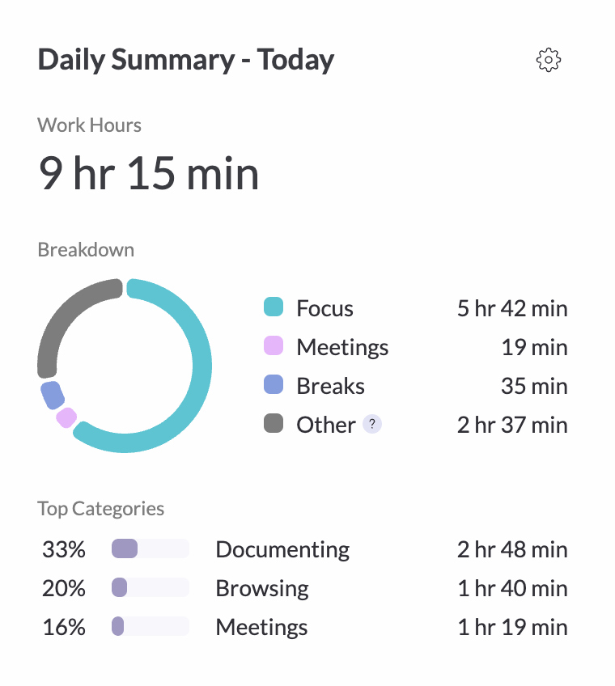

# ♾️ 2주차 과제 & 벡터 공간 학습

## 날짜: 2025-02-08 📅

### 스크럼 🏁
- 오늘 할 일 공유 및 동기부여  
- 2주차 과제 진행 및 학습 목표 설정 

### 새로 배운 내용 📚
#### 2주차 과제: NumPy, Pandas, HTTP 통신 활용✨
- 

#### 수업 복습: 벡터공간 💡
- 벡터 공간을 제대로 이해하려면 그 기반이 되는 수학적 구조들을 알아야 한다.
- 논문에도 많이 나오는 용어로 *군 정도는 알아두는 것이 좋다. 
| 개념 | 정의 |
| --- | --- |
| **마그마(Magma)** | 집합 + 이항 연산 (S,∗S, *S,∗)이 정의된 구조 (ex. 자연수와 덧셈) |
| **반군(Semigroup)** | 마그마 + 결합법칙 만족 |
| **모노이드(Monoid)** | 반군 + 항등원 존재 |
| **군(Group)** | 모노이드 + 역원 존재
결합법칙, 항등원(모노이드), 역원 |
| **환(Ring)** | 두 개의 연산(덧셈, 곱셈)이 존재하는 구조 (ex. 정수 Z\mathbb{Z}Z) |
| **체(Field)** | 덧셈과 곱셈이 가능하며 0이 아닌 원소에 대해 나눗셈도 가능한 구조 (ex. 실수 R\mathbb{R}R, 유리수 Q\mathbb{Q}Q) |
| **벡터 공간(Vector Space)** | 체 위에서 벡터 덧셈과 스칼라 곱셈이 정의된 공간 |

### **벡터 공간이 인공지능에서 중요한 이유**

- **행렬 연산이 필수적**→ 신경망에서 가중치 업데이트, 선형변환, PCA 같은 기법을 사용할 때 기본 개념이 됨.
- **딥러닝에서 사용되는 텐서(Tensor) 연산도 벡터 공간의 확장판**→ PyTorch, TensorFlow에서 다루는 텐서 연산의 기본 개념.
- **데이터 표현**→ 자연어 처리(NLP)에서 단어 임베딩(Word2Vec, BERT)도 벡터 공간에 매핑됨.

---

### **한 줄 요약**

**벡터 공간은 체 위에서 정의된 벡터들의 집합으로, 덧셈과 스칼라 곱셈 연산을 만족하는 구조이다. 이를 이해하려면 마그마 → 군 → 환 → 체 → 벡터 공간 순으로 수학적 개념을 확장해야 한다.**

### 오늘의 도전 과제와 해결 방법 🔥
- 🎯 오늘의 도전과제: NumPy 배열 곱하기 정리
✅ 다양한 곱셈 방법

| 연산 | 설명 | 예제 |
|------|------|------|
| `np.multiply(A, B)` | 요소별 곱셈 | `(3,3) * (3,3) → (3,3)` |
| `A * B` | 요소별 곱셈 (연산자 사용) | `(3,3) * (3,3) → (3,3)` |
| `np.matmul(A, B)` | 행렬 곱셈 | `(3,3) @ (3,2) → (3,2)` |
| `A @ B` | 행렬 곱셈 (연산자 사용) | `(3,3) @ (3,2) → (3,2)` |
| `A * v` | 브로드캐스팅 | `(3,3) * (3,) → (3,3)` |

### 📌 한 줄 요약
NumPy에서 곱하기 연산을 할 때 **요소별 곱셈인지, 행렬 곱셈인지, 브로드캐스팅인지 구분하는 것이 중요하다!**

### 오늘의 회고 📝
- NumPy, Pandas, HTTP 요청을 활용하여 데이터를 처리하는 실습을 진행했다.
- 벡터 공간의 개념을 정리하면서, 군(Group)과 체(Field)의 역할을 이해할 수 있었다.
- 데이터 과학과 머신러닝에서 벡터 공간 개념이 필수적이라는 점을 다시 한 번 실감했다.

### 참고 자료 및 링크 🔗
- [추상대수학, 군](https://www.youtube.com/watch?v=8_1P6krxr6Q)
군환체가 잘 이해가지 않을 때 보면 좋을 것 같다.
- [실수의 완비성](https://www.youtube.com/watch?v=wFI7K9AHi10)